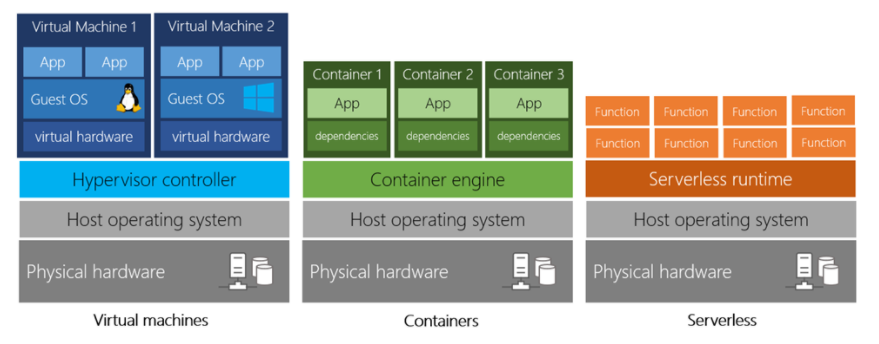
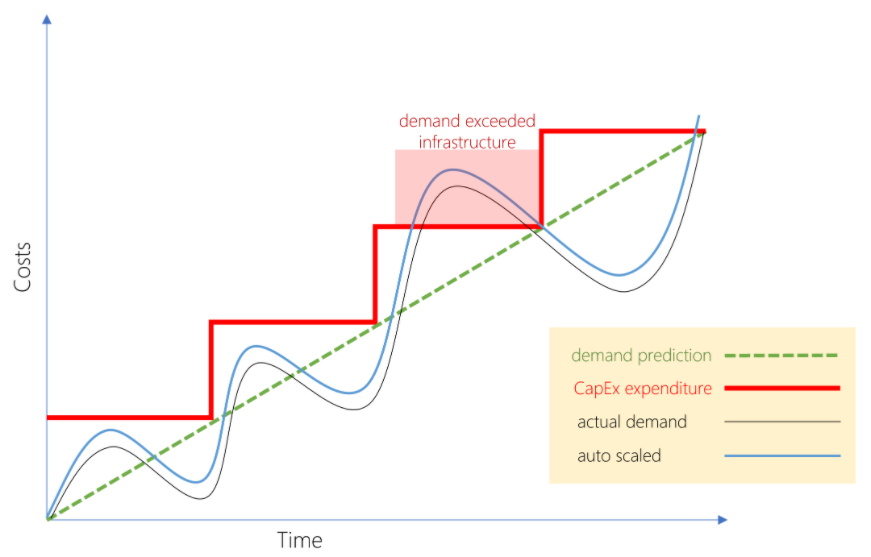

### Microsoft Azure 클라우드 개념 살펴보기(AZ-900)																						Date: 18th Sep 2020	

#  Discuss why cloud services

## Learning objectives

> - Define key terms you will encounter when working with cloud services.
> - Discuss the benefits of cloud computing.
> - Decide which cloud deployment model will work best for you.

## Define cloud computing

- Common cloud computing services
  - Compute power - such as Linux servers or web applications.
  - Storage - such as files and databases.
  - Networking - such as secure connections between the cloud provider and your company.
  - Analytics - such as visualizing telemetry and performance data.

### Cloud computing services

> The goal of cloud computing is to make running a business easier and more efficient.

- Compute power

  - Virtual machine(VM)

    - Emulation of a computer.
    - You can have more control and responsibility over maintenance.

  - Containers

    - Containers provide a consistent, isolated execution environment for applications.
    - Application and all its dependencies is packaged into a 'container' and then a standard runtime environment is used to execute the app.(Don't require a guest operating system.)

  - Severless computing

    - The core idea is that your application is broken into separate functions that run when triggered by some action.
    - Only pay for the processing time used by each function as it executes.

    

- Storage
  
  - Cloud-based data storage is you can scale to meet your needs.

## Explore key cloud concepts

- Cloud service's characteristics and considerations
  - __High availability(고가용성)__
  - __Scalability(확장성)__ : Doesn't have to be done automatically.
  - __Elasticity(탄력성)__ : Is done automatically.
  - __Agility(민첩성)__
  - __Fault tolerance(내결함성)__
  - __Disaster recovery(재해복구)__
  - __Global reach(접근성)__
  - __Customer latency capabilities(고객 응답 지연)__
  - __Predictive cost considerations(예측 비용 고려사항)__
  - __Technical skill requirements and considerations(기술적 요구사항과 고려사항)__
  - __Increased productivity(향상된 생산성)__
  - __Security(보안성)__

## Discuss economies of scale

- Economies of scale it the ability to reduce costs and gain efficiency when operating at a large scale in comparison to operating at a smaller scale.

## Compare CapEx vs OpEx

- __Capital Expenditure (CapEx)__ : Up front spending of money on physical infrastructure.
  - A typical on-premises datacenter includes costs such as:
    - Storage costs
    - Network costs
    - Backup and archive costs
    - Organization continuity and disaster recovery costs
    - Datacenter infrastructure costs
    - Technical personnel
- __Operational Expenditure (OpEx)__ : Spending money on services or products now.
  - Operational expenses such as:
    - Leasing software and customized features
    - Scaling charges based on  usage/demand instead of fixed hardware or capacity
    - Billing at the user or organization level

## Define consumption-based models

- Benefits of Consumption-based model
  - No upfront costs.
  - No need to purchase and manage costly infrastructure that they may or may not use to its fullest.
  - The ability to pay for additional resources when they are needed.
  - The ability to stop paying for resources that are no longer needed.

## Microsoft Azure

- __Compute__ services such as VMs and containers that can run your applications
- __Database__ services that provide both relational and NoSQL choices
- __Identity__ services that help you authenticate and protect your users
- __Networking__ services that connect your datacenter to the cloud, provide high availability or host  your DNS domain
- __Storage__ solutions that can accommodate massive amounts of both structured and unstructured data
- __AI and machine-learning__ services can analyze data, text, images, comprehend speech, and make predictions using data changing the world of agriculture, healthcare, and much more.
- And many more!