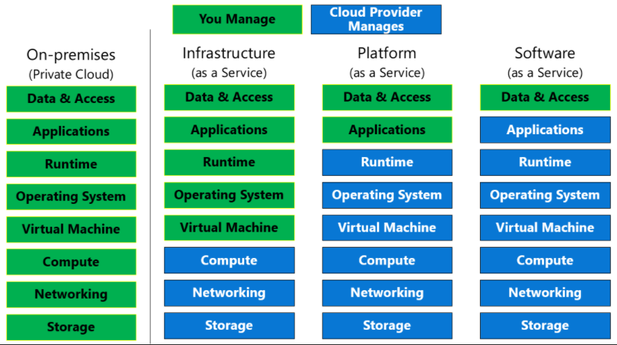
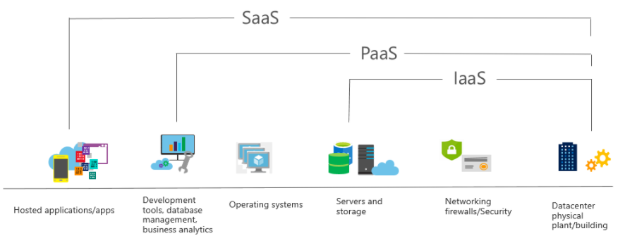

### Microsoft Azure 클라우드 개념 살펴보기(AZ-900)																						Date: 18th Sep 2020	

#  Explore types of cloud services

## Learning objectives    

> - Describe infrastructure as a services (IaaS).
> - Describe platform as a services (PaaS).
> - Describe software as a services (SaaS).

## Discuss shared responsibility model

- The following list of cloud service types describe the management responsibilities for the user and the cloud provider as compared to on-premises systems:

  

## Define IaaS

- IaaS characteristics

  - __Upfront costs__ - Users pay only for what they consumer.
  - __User ownership__ - The user is responsible for the puchase, installation, configuration, and management of their own software operating systems, middleware, and applications.
  - __Cloud provider ownership__ - The cloud provider is responsible for ensuring that the underlying cloud infrastructure is available for the user.
- Common IaaS usage scenarios
  - Migrating workloads.
  - Test and development.
  - Website hosting
  - Storage, backup, and recovery.
- When using IaaS, ensuring that a service is up and running is a shared responsibility:
  - The cloud provider is responsible for ensuring the cloud infrastructure is functioning correctly.
  - The cloud customer is responsible for ensuring the service they are using is configured correctly.

## Define PaaS

- PaaS characteristics
  - __Upfront costs__ - There are no upfront costs, and user pay only what they consume.
  - __User ownership__ - The user is responsible for the development of their own applications.However, they are not responsible for managing the server or infrastructure.
  - __Cloud provider ownership__ - The cloud provider is responsible for operating system management, typically responsible for everything apart from the application that a user wnats to run.
- Common PaaS usage scenarios
  - Development framework.
  - Analytics or business intelligence.
- The goal of PaaS is to help craete an application as quickly as possible without having to worry about managing the underlying infrastructure.

## Define SaaS

- SaaS characteristics
  - __Upfront costs__ - User have no upfront costs; they pay a subscription, typically on a montly or annual basis.
  - __User ownersihp__ - User just use the application software; they are not responsible for any maintenance or management of that software.
  - __Cloud provider ownersihp__ - The cloud provider is responsible for the provision, management, and maintenance of the application software.
- Common SaaS usage scenarios
  - Examples of Microsoft SaaS services include Microsoft 365, Skype, and Microsoft Dynamics CRM Online.
- SaaS is software that is centrally hosted and managed for the end customer.

## Compare cloud services

| Type     | Advantage                                                    | Disadvantage           |
| -------- | ------------------------------------------------------------ | ---------------------- |
| __IaaS__ | - No CapEx - Agility - Consumption-based model - Skills - Cloud benefits - Flexibility | - Management           |
| __PaaS__ | - No CapEx - Agility - Consumption-based model - Skills - Cloud benefits - Productivity | - Platform limitations |
| __SaaS__ | - No CapEx - Agility - Pay-as-you-go pricing model - Flexibility | - Software limitations |