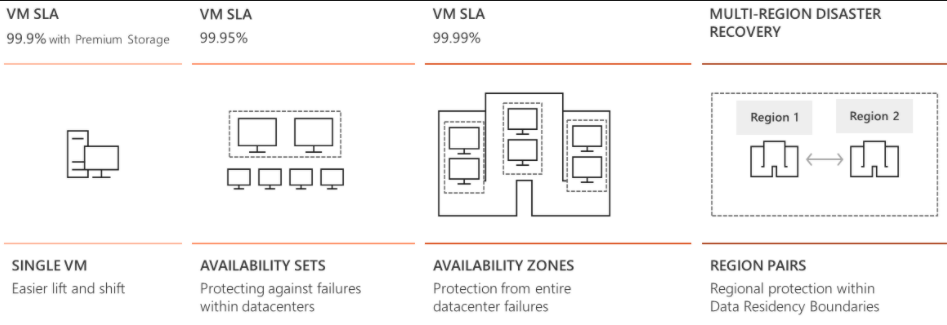
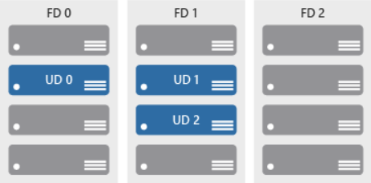
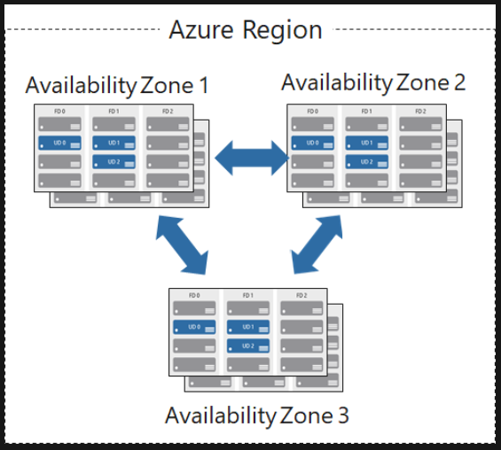
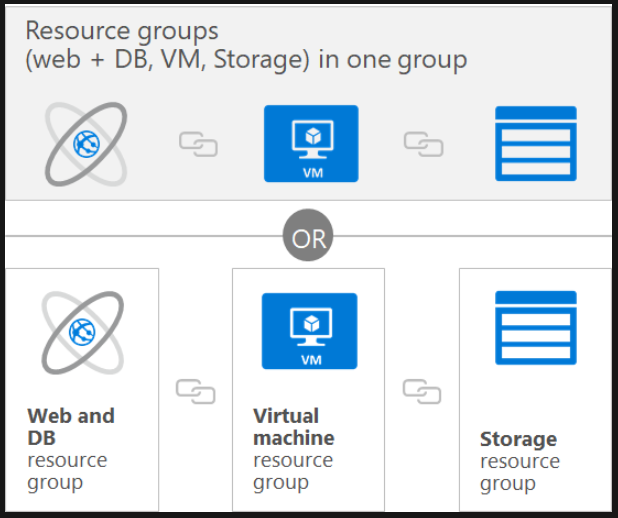

### Microsoft Azure 핵심 서비스 구분(AZ-900)																						Date: 28th Sep 2020	

#  Explore types of cloud services

## Learning objectives    

> - Explore the physical structure of Azure infrastructure.
> - Describe the service level agreements provided by Azure.
> - Provide your own service level agreements for your apps.

## Examine regions

- Regions
  - A region is a geographical area on the planet contatining at least one, but potentially mulitle datacenters that are in close proximity and networked together with a low-lantency network.

- Things to know about regions
  - Azure has more global regions than any other cloud provider.
  - Regions provide customres the flexibility and scale needed to bring applications closer to their users.
  - Regions preserve data residency and offer comprehensive compliance and resiliency options for customers.
  - For most Azure services, when you deploy a resource in Azure, you choose the region where you want your resource to be deployed.

## Explore region pairs

- Region Pairs
  - Each Azure region is paried with another region within the same geography at least 300 miles away, which together make a region pair.

- Thigs to know about regional pairs
  - __Physical isolation__ : Azure prefers at least 300 miles of seperation between datacenters in a regional pair.
  - __Platform-provided replication__ : Some services such as Geo-Redundant Storage provide automatic replicaition to the paired region.
  - __Region recovery order__ : In the event of a broad outage, recovery of regions is prioritized out of every pair. Applications that are deployed across paired regions are guaranteed to have one of the regions recovered with priority.
  - __Sequential updates__ : Planned Azure system updates are rolled out to paired regions sequentially to minimize downtime.

## Define geographies

> An Azure geography is a discrete market typically containing two or more regions that preserves data residency and compliance boundaries.

- This division has several benefits.
  - Geographies allow customers with specific data residency and compliance needs to keep their data and applications close.
  - Geographies ensure that data residency, sovereignty, compliance, and resiliency requirements are honored within geographical boundaries.
  - Geographies are fault-tolerant to withstand complete region failure through their connection to dedicated high-capacity networking infrastructure.

- Geographies are broken up into the following areas
  - Americas
  - Europe
  - Asia Pacific
  - Middle East and Africa

## Determine availability options

- Availability Options

  

  

## Define availability sets

- Availability sets

  

  - __Update domains (UD)__
    - When a maintenance event occurs, the update is sequenced through update domains.
    - Sequencing updates using update domains ensures that the entire datacentr isn't unavailable during platform updates and patching.
    - Update domains are a logical section of the datacenter, and they are implemented with software and logic.
  - __Fault domains (FD)__
    - Faults domains provide for the physical separation of your workload across different hardware in the datacenter.
    - This includes power, cooling, and network hardware that supportsthe physical servers located in server racks.
    - In the event the hardware that supports a srever rack becomes un available, only that rack of servers would be affected by the outage.

## Define availability zones

> Availability zones are physically separate locations within an Azure region that use availability sets to provide additional fault tolerance.

​	

- Availability Zone features
  - Each availability zone is an isolation boundary containing one or more datacenters equipped with independent power, cooling, and networking.
  - If one availability zone goes down, the other continues working.
  - The availability zones are typically connected to each other through very fast, private fiber-optic netowrks.
  - Availability zones allow customers to run mission-critical applications with high availability and low-latency replication.
  - Availability zones are offered as a service within Azure, and to ensure resiliency, there's minimum of three separate zones in all enabled regions.

- Azure services that support Availability Zones fall into two categories
  - __Zonal services__ : You pin the resource to a specific zone. (for example, virtual machines, managed disks, IP addresses)
  - __Zone-redundant services__ : Platform replicates automatically across zones.  (for example, zone-redundant storage, SQL Database).

## Explore resource groups

- __Resource Group__

  - A resource group is a unit of management for your resources in Azure.
  - Resource group is as a container that allows you to aggregate and manage all the resources required for your application in a single manageable unit. This allows you to manage the application collectively over its lifecycle, rather than manage components individually.
  - Before any resource can be provisioned, you need a resource group for it to be placed in.

  

- Resource group level of manage and apply
  - Metering and billing
  - Policies
  - Monitoring and alerts
  - Quotas
  - Access control

- Considerations
  - Each resoure must exist in one, and only one, resource group.
  - A resource group can contain resources that reside in different regions.
  - You decide how you want to allocate resources to resource groups based on what makes the most sense for your organization.
  - You can add or remove a resource to a resource group at any time.
  - You can move a resource from one resource group to another.
  - Resources for an applications do not need to exist in the same resource group. However, it is recommended that you keep them in the same resource group for ease of management.

- Create a resource group
  - Resource groups can be created by using the following methods:
    - Azure portal
    - Auzre PowerShell
    - Azure CLI
    - Templates
    - Azure SDKs

## Explore Azure resource manager

- __Azure Resource Manger__
  - This is a management layre in which source groups and all the resources within it are created, configured, managed, and deleted.
  - With Azure Resource Manager, you can :
    - __Deploy Application resources__ : Update, manage, and delete all the resources for your solution in a single, coordinated opertaion.
    - __Organize resources__ : Mange your infrastructure thorugh declarative templates rather than scripts. You can view which resources are linked by a dependency, and you can apply tags to resources to categorize them for management tasks, such as billing.
    - __Control access and resources__ : You can control who in your organization can perform actions on the resources. You manage permissions by defining roles, adding users or groups to the roles, and applying policies at resource group level.