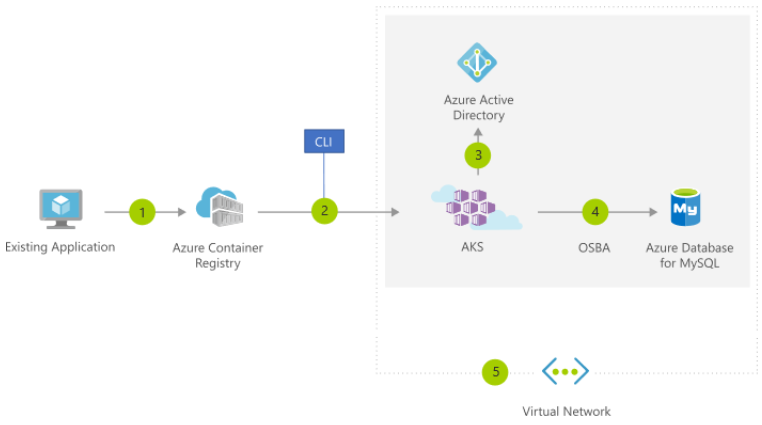

### Microsoft Azure 핵심 서비스 구분(AZ-900)																						Date: 29th Sep 2020	

#  Define core Azure services and products

## Learning objectives    

> - Identify compute options in Azure
> - Select compute options that are appropriate for your business
> - Learn how an Azure virtual network provides secure network communication among resources such as virtual machines and other networks
> - Explore what high availability and resiliency mean and how Azure Load Balancer can increase resiliency within a single geographic region
> - Discuss what latency is and how Traffic Manager helps reduce network latency and provides resiliency across geographic locations
> - Survey the data storage options in Azure
> - Discover how Azure data storage can meet your business demands
> - Compare Azure data storage with on-premises storage

## Define Azure Compute

- __Azure compute__
  - This is an on-demand computing service for running cloud-based applications.
  - It provides computing resources such as disks, processors, memory, networking and operating systems.
  - Two of the most common compute servcies are __virtual machines__ and __containers__.

## Explore Azure Compute services

- Explore Auzre virutal machines
  - It provieds IaaS and can be used in a variety of different ways.
  - Azure VMs are an ideal choice of total control over an operating system and environment.
  - Jusk like a physical computer, you're able to customize all the software running on the VM.

- Virtual machine scale sets
  - Virtual machine scale sets are an Azure compute resource that you can use to deploy and manage a set of identical VMs.
  - With all configured the same, virutal machin scale sets are designed to support true autosclae; no pre-provisioning of VMs is required; and as such makes it easier to build large-scale services targeting big compute, big data, and containerized workloads.

- App services
  - With App services, you can quickly build, deploy, and scale enterprise-grade web, mobile and API apps running on any platform.
  - This is a PaaS offering.

- Functions
  - Azure Functions are ideal when you're concerned only about the code running your service and not the underlying platform or infrastructure.

## Define container services

> The container orchestrator can start, stop, and scale out application instance as needed.

- Containers are a virtualization environment.
  - Containers reference the operating system of the host environment that runs the container.
  - Unlike virtual machines you do not manage the operating system.
  - Containers are lightweight and are designed to be created, scaled out, and stopped dynamically.
  - Containers allows you to respond to changes on demand and quickly restart in case of a crash or hardware interruption.
  - Azure supports Docker containers.

- __Azure Container Instances__
  - Azure Container Instances offers the fastest and simplest way to run a container in Azure without having to manage any virtual machines ore adopt an y additional services.
  - It is a PaaS offering that allows you to upload your containers, which it will run for you.

- __Azure Kubernetes Service__
  - This is a complete orchestration service for containers with distributed architectures and large volumes of containers.
  - The task of automating, managing, and interacting with a large number of containers is knows as orchestration.

​	

- The preceding figure depicts this process as follows:
  1. You convert an existing application to one or more containers and then publish one or more container images to the Azure Container Registry.
  2. By using the Azure portal or the command line, you deploy the containers to an Azure Kubernetes Service (AKS) cluster.
  3. Azure AD controls access to AKS resources.
  4. You access SLA-backed Azure sercives, such as Azure Database for MySQL, via Open Service Broker for Azure (OSBA).
  5. Optionally, AKS is deployed with a virtual network.

## Explore Auzre network services

- __Azure Virtual Network__
  - Azure Virtual Network enables many types of Azure resources to securly communicate with each other, the internet, and on-premises networks.
  - A virtual netwrok is scoped to a single region; however, multiple virtual networks from different regions can be connected using virtual network peering.
  - With Azure Virtual Network you can provide isolation, segmentation, communication with on-premises and cloud resources, routing and filtering of network traffic.

- __Azure Load Balancer__
  - Azure Load Balancer can provide scale for your applications and create high availability for your services.
  - Load Balancer supoorts inbound and outbound scenarios, provides low latency and high throughput, and scales up to millions of flows for all Transmission Control Protocol (TCP) and User Datagram Protocol (UDP) applications.

- __Virtual Private Network (VPN) gateway__
  - A VPN gateway is a specific type of virtual network gateway that is used to send encrypted traffic between an Azure Virtual Network and on-premises location over the public internet.

- __Azure Application Gateway__
  - Azure Application Gateway is a web traffic load balancer that enables you to manage traffic to your web applications.
  - With Application Gateway you can route traffic based on source IP address and port to a destination IP address and port.
  - You also can help protect a web application with a web application firewall, redirection, session affinity to keep a user on the same server, and many more configuration options.

- __Content Delivery Netwrok__
  - A Content Delivery Network (CDN) is a distributed network of servers that can efficiently deliver web content to users. It is a way to get content to users in their local region to minimize latency.
  - CDN can be hosted in Azure or any other location. You can cache content at strategically placed physical nodes across the world and provide better performance to end users.
  - Typcial useage scenarios include web applications containing multimedia content, a product launch event in a region, or any event where you expect a high bandwidth requirement in a region.

## Define Azure data categories

- __Structured data__
  - Structured data is data that adheres to a schema, so all the data has the same fields or properties.
  - Structured data can be stored in a database table with rows and columns.
  - Structured data is also known as relational data. The data's schema defines the table of data, the fields in the table, and the clear relationship between the two.
  - Structured data is easy to enter, query, and analyze because all the data follows the same format.
  - Examples of structured data include sensor data or financial data.

- __Semi-structured data__
  - Semi-structured data is less organized than structured data.
  - Semi-structured data is not stored in a relational format, meaning the fields do not neatly fit into tables, rows, and columns.
  - Semi-structured data contains tags that make the organization and hierarchy of the data apparent.
  - Semi-structured data is also known as non-relational or NoSQL data.
  - Examples of semi-structured data include books, blogs, and HTML documents.

- __Unstructured data__
  - Unstructured data has no designated structure.
  - Unstructured data can hold any kind of data.
  - Unstrudcued data is becoming more prominet as businesses try to tap into new data sources.
  - Examples of unstructured data include a PDF document, a JPG image, a JSON file, and video content.

## Explore Azure Storage

- __Disk storage__
  - Disk storage provides disks for virtual machines, applications, and other services to access and use they need, similar to how they would in on-premises scenarois.
  - Disk storage allows data to be persistently stored and accessed from an attached virtual hard disk.
  - The disks can be managed or unamanged by Azure, and therefore managed and configured by the user.
  - Typical scenarios for using disk stroage are if you want to lift and shift applications that read and write data to persistent disks, or if you are storing data that is not required to be acceesed from outside the virtual machine to which the disk is attached.

- __Containers (Blobs)__
  - Azure Blob storage is Microsoft's object stoarge solution for the cloud. Blob storage is optimized for storing massive amounts of unstructured data, such as text or binary data.
  - Blob storage is ideal for:
    - Serving images or documents directly to a browser.
    - Storing files for distributed access.
    - Streaming video and audio.
    - Storing data for backup and restore, disaster recovery, and archiving.
    - Storing data for analysis by an on-premises or Azure-hosted service.

- __Files__
  - Azure Files enable you to set up highly available network file shares that can be accessed by using the standard Server Message Block (SMB) protocol. That means that multiple VMs can share the same file with both read and wirte access. You can also read the files using the REST interface or the storage client libraries.
  - One thing that distinguishes Azure Files from files on a corporate file share is that you can access the files from anlywhere in the world using a URL that points to the file and includes a shared access singnature (SAS) token. You can gererate SAS tokens; they allow specific access to a private asset for a specific amount of time.

- __Queues__
  - The Azure Queue service is used to store and retrieve messages. Queue messages can be up to 64 KB in size, and a queue can contain millions of messages. Queues are generally used to store lists of messages to be processed asynchronously.

- __Tables__
  - Azure Table storage stores large amounts of structured data. The service is a NoSQL datastore which accepts authenticated calls from inside and outside the Auzre cloud. Azure tables are ideal for storing structured, non-relational data.
  - Common uses of Table storage include :
    - Storing TBs of structured data capable of serving web scale applications.
    - Stroing datasets that don't requrie complex joins, foreign keys, or stored procedures and can be denormalized for fast access.
    - Quickly querying data using a clustered index.

## Explore Azure database services

> Azure database services are fully managed PaaS database services.

- __Azure Cosmos DB__
  - Microsoft Azure Cosmos DB is a globally distributed database service that enables you to elastically and independently scale throughput and storage across any number of Azure's geographic regions.
  - It supports schema-less data.
  - You can use Cosmos DB to store data that is updated and maintained by users around the world.

- __Azure SQL Database__
  - Azure SQL Database is a relational database as a service (DaaS) based on the latest stable version of Microsoft SQL Server database engine.
  - SQL Database is a high-performance, reliable, fully managed and secure database that you can use to build data-driven applications and websites in the programming language of you choice without needing to manage infrastructure.

- __Azure Database Migration__
  - The Azure Database Migration Service is a fully managed service designed to enable seamless migrations from multiple database sources to Azure data platform with minimal downtime (online migrations).
  - The services uses the Microsoft Data Migration Assistant to generate assessment reports that provide recommendations to help guide you through required changes prior to performing a migration.
  - The Azure Database Migration Service performs all of the required steps.

## Explore Azure Marketplace

- Azure Marketplace is a service on Azure that helps connec end users with Microsoft partenrs, independent software vendors (ISVs), and start-ups that are offering their solutions and services, which are optimized to run on Azure.

