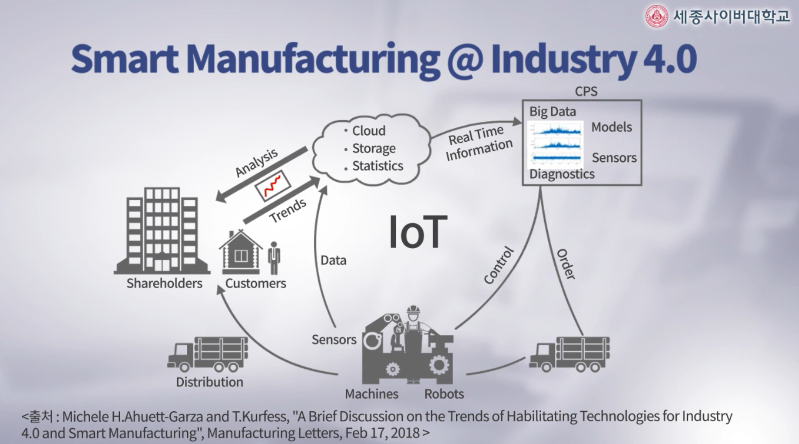
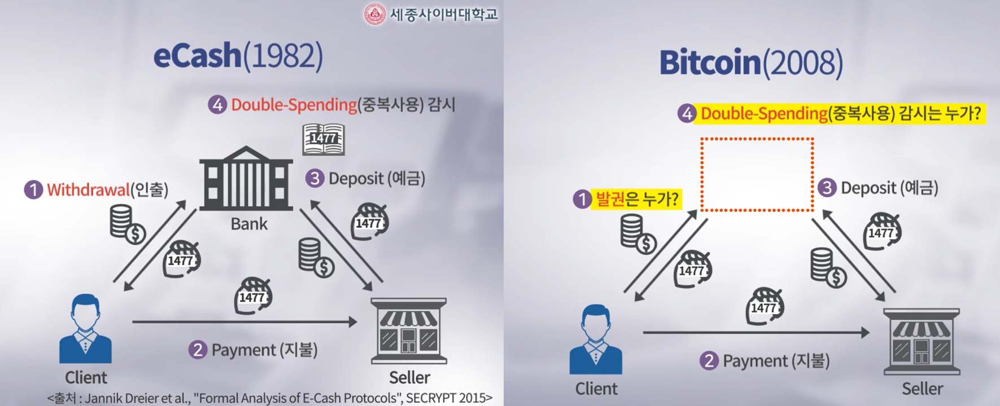
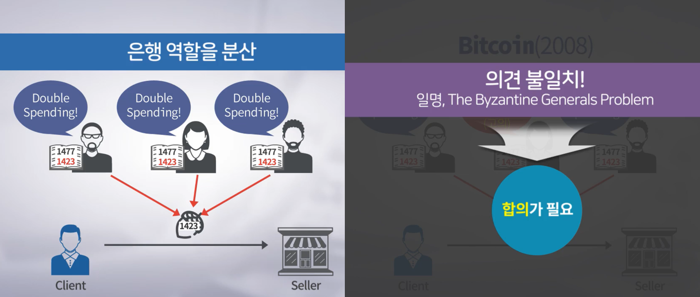

# 1. 4차 산업혁명과 블록체인

## 1-1. 4차  산업혁며 개요와 사이버 위협

#### 	4차 산업혁명과 3차 산업혁명의 차이

- 4차 산업혁명 키워드
  - CPS(Cyber Physical System)
  - O2O(Online to Offline) 
  - 사이버 공간과 현실 세계가 밀접하게 연결되어 있다는 것
  
- 3차 산업혁명(단순한 디지털화) // 4차 산업혁명(변화가 __다양한 분야에서 동시다발적으로 일어나 상호 융합__)

- IoT(정보수집) -> Cloud(저장) -> AI(빅데이터 분석) -> 맞춤형 물류 생산

  

- 4차 산업에서의 해킹은 현실세계에 영향을 미침(사이버 보안이 매우 중요함)

- 현재 노출된 보안 위협들
  - 스마트폰 해킹을 통해 컴퓨터의 CPU는 명령어 처리에 따라 다른 작동 소리를 내고 이를 수집하고 분석해 CPU의 처리 내용을 다 알아낼수 있음
  - 사람이 들을 수 없는 고주파의 목소리로 스마트폰에 명령에 중요한 정보를 전송할 수 있음
  - 심박 조절기 해킹 가능(심각한 인명피해 발생)
  
- 위의 보안의 위협들로부터 보안을 염두해 계획하고 만드는게 중요함

#### 4차 산업혁명 시대에 발생할 수 있는 해킹 위협

- 일상생활에서 쉽게 해킹당할 수 있는 주변기기들
  - 스마트 TV (2013년 국내 S사 스마트 TV 해킹 시연 / 2017년 국내 L사 스마트 TV 해킹 시연) 
    - 집안에서 일어나는 모든 일들은 도촬 및 도청할 수 있음
    - 송출하는 화면을 조작해서 보여줄 수 있음
  - 커넥티드카(2015년 해킹됨)
    - 차량의 소프트웨어를 제어해 원격조정이 가능함
  - 비행기, 최첨단 군무기체계(핵잠수함, 전투기 등등)

## 1-2. 블록체인과 암호화폐의 개념적 이해

#### 암호화폐의 시작

- 디지털 화폐(Digital Currencies)
  - 가상화폐(VIrtual Currencies) : 게임머니, 마일리지 등등
  - 암호화폐(Crypto Currencies) : 비트코인, 이더리움 등등

- 비트코인(Bitcoin - 2008)
  - 사토시 나카모토(Satoshi Nakamoto)가 개발 - 개인 or 단체, 국적, 성별, 생사여부 그 어떤 것도 불분명함
  - 과거부터 연구되어 오던 기술들을 잘 조합시켜 혁명적인 비즈니스 모델로 만듬
  - 최초의 탈중앙화된 암호화폐(분산 처리된 암호화폐)
- 최초의 암호화폐(1982년 데이비드 차움 박사에 의해 개발 -> 프라이버시 보호의 아버지)
  - 인터넷 공간에서도 기록을 남기지 않기 위해 현찰 처럼 쓸 수 있는 Untraceable Payments(추적 불가능한 결제시스템)을 만들어냄

#### 초창기 가상화폐의 개념: eCash와 비트코인

|                특징 \ 암호화폐                | eCash(1982) | Bitcoin(2008) |
| :-------------------------------------------: | :---------: | :-----------: |
|               Anonymity(익명성)               |      O      |       O       |
|            Transferability(양도성)            |      O      |       O       |
| Prevent Copy & Double-Spending(중복사용 방지) |      O      |       O       |
|           Decentralized(분산 처리)            |      X      |       O       |

​	

- eCash 는 중앙서버가 발권과 중복사용 방지 등을 검사하지만 이를 사용자들 모두가 자발적으로 참여하게 함으로써 탈중앙화 해서 운영할 수 있게 구현한게 블록체인(합의 기능이 내장된 분산 장부)을 이용한 비트코인이다.

#### 블록체인과 암호화폐의 연관성

- 비트 코인은 중앙서버가 아닌 개별 사용자들이 각각의 pc에 데이터베이스를 운용

- __각각의 데이터베이스들 간의 데이터 불일치, 의견 불일치__가 실수적이던 고의적이던 생기게 생기게 됨

- 이것들을 __조율하기 위한 메커니즘이 블록체인__

- 합의 과정

  1. 각자가 관찰한 10분 간의 모든 거래내역을 장부(일명, Block)에 기록

  2. 회람

  3. 서로 다른 장부가 존재할 경우 투표

  4. 선출된 장부를 각자 보관 중이던 이전 장부에 연결해(일명, Chain) 보관

     -> 3, 4 번은 동시에 발생

  => 이 시스템을 진행하기 위해선 개인의 pc가 24시간 365일 운영되어야 함(자발적 참여에 어려움)

  => 이를 해결하고 인센티브 개념 - 채굴(Mining)

- 채굴(Mining)

  - 위와 같은 협의 과정을 열심히 한 사람에게 비트코인을 지급
  - 이를 통해 중복 사용 방지와 발권의 문제를 해결 가능

- 알트코인(Alternativecoin의 약자) - 비트코인을 제외한 나머지 모든 코인

## 1-3. 4차 산업혁명에서의 블록체인의 역할

#### 기존 O2O 플랫폼의 한계

- 정보의 가두리 양식
- __플랫폼 이펙트__ : 정보를 많이 갖고 있는 온라인 투 오프라인 플랫폼 사업자가 사용자의 정보를 통해서 이익을 창출해내는 혜택이 일부 시장에 지배적 사업자들한테 집중(=혜택과 가치가 집중)되는 현상
- 4차 산업혁명 시대에 모든 참여자들한테 혜택이 골고루 가게끔 하는데 __블록체인__ 기술이 사용될 수 있음

#### 기존 기술을 극복하기 위한 블록체인의 특징

- __Blockchain__ : 일정 주기로 정보가 담긴 블록(장부)을 생성한 후 이전 블록들에 체인처럼 연결하는 기술(블록체인 기술 발전전략, 과학기술정보통신부, 2018)

- Blockchain의 특징 (참여자의 합의에 기반하여 작동함)

  - __탈중앙성(De-Centralization)__ : 중앙 관리자의 역할을 참여자가 분담
  - __투명성(Transparency)__ : 참여자들 간의 모든 정보가 공유됨
  - __불변성(Immutability)__ : 참여자들 간의 합의  이후 기록된 내용의 위변조 및 삭제가 불가
  - __가용성(Availability)__ : 참여자들 간의 정보에 대한 접근이 용이(365일 24시간 사용 가능)
- 개인의 프라이버시를 침해 당하지 않도록 극대화된 투명성을 어느정도 제어할 수 있는 프라이버시 보호 기술도 필요
