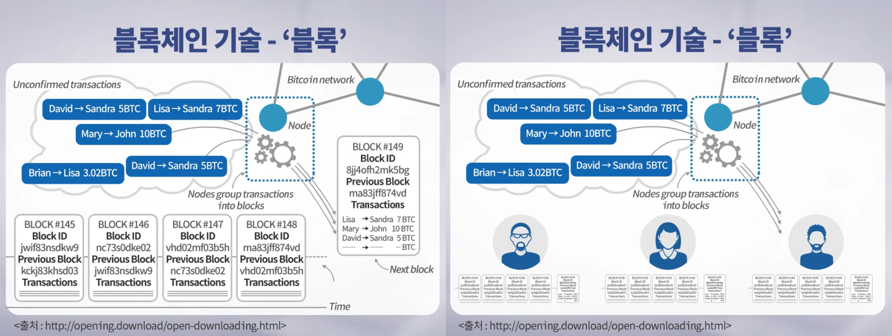
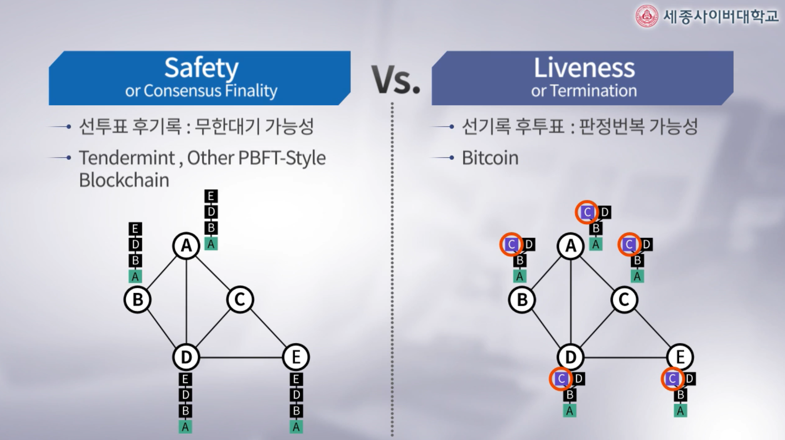
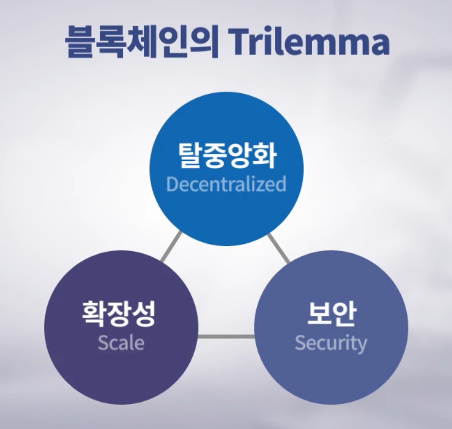

# 2. 블록체인의 개요

## 2-1. 암호화폐 비트코인의 핵심기술, 블록체인

#### 암호화폐 비트코인의 핵심기술, 블록체인

- 비트코인 관련한 소프트웨어를 PC에 설치시 설치되는 모듈들
  - 지갑(Wallet) : 실제로 암호화폐를 사용하는 것과 관련된 기능
    - 전자 지갑 주소(계좌)를 가지고 있으며 인터넷 뱅킹의 계좌번호와 달리 걸래시 실명확인을 하지 않기 때문에  익명성이 보장됨
  - 풀 블록체인(Full Blockchain) : 모든 거래 기록, 블록체인들을 저장하는 기능
  - 채굴(Miner) : 채굴 기능
  - Network Routing Node(인터넷 라우팅 노드) : 통신을 하기 위한 모듈
- 블록체인이 생성되는 과정 및 특징(해킹이 불가능한 기술X)
  - 계좌이체를 할 때 비트코인 속에 있는 모듈을 통해 전자서명을 하게 10분 단위로(한 블럭에) 인터넷에서 일어났떤 모든 거래 기록을 파일에 기록함
  
  - 10분이 지나면 모든 사용자들이 서로의 블록을 회람하며 비교하고 블록의 기록이 다른 경우 투표(__탈중앙성__을 가능하게 하는 이유)에 부쳐 많은 사용자가 옳다, 라고 생각한 블록이 선정돼 다음 블록에 연결됨(체인)
  
  - 체인에는 해시함수 기술을 이용하며 체인에 연결된 경우 삭제나 수정이 불가능함(__불변성__)
  
  - 모든 사용자의 PC에 블록이 저장되므로 다른 사람의 거래 내역을 아무나 확인 할 수 있음(__투명성__) 또한 한 사용자의 PC가 해킹당한다고 해도 다른 사용자의 PC에서 장부를 언제든 복사해 올 수 있음(__가용성__)
  
    

#### 암호화폐 비트코인의 핵심기술, 블록체인

- Genesis Block : 최초로 생성된 블럭
- 블록체인 기술 - 합의
  - 합의 방법1
    - 선투표 후기록
    - 10분 동안의 거래 내역을 가장 먼저 기록한 사용자가 다른 모든 사용자에게 자신의 블럭(장부)을 보내고 다른 사용자들이 회람해 만장일치일 경우 다음 블럭으로 연결(체인)하고 이와 다른 기록 내용이 다른 블럭을 생성한 사용자가 있을 경우 다시 자신이 만든 모든 블럭을 모든 사용자에게 보내고 회람하여 더 많은 사용자가 옳다고 생각하는 블럭 하나만 연결(체인)함
    - 투표의 결과가 무한대기에 빠질 가능성이 있음
    - Tendermint, Other PBFT-Style Blockchain 에 사용되는 방식
  - 합의 방법2(The Longest Chain Rule)
    - 선기록 후투표
    - 만장일치일 경우에는 문제가 없지만 기록 내용이 다를 경우 내용이 다른 블록 두개 모두 연결(체인) 그 다음 10분의 기록 내용을 최초로 다 기록한 사용자가 그 전 단계의 블럭 중 더 옳다고 생각하는 하나의 블럭을 선택해 그 뒤에 자신이 만든 블럭을 연결함 -> 일단은 짧아 보이는 체인이라도 나중에 사람들이 몰리게 될 경우 가장 긴 체인이 바뀔 가능성이 있으므로 이를 방지하기 위해 보통 블럭 뒤에  6개 이상의 블럭이 체인될 경우 안정화된 블럭(Decided Block)으로 인정하는 룰을 적용하고 있음
    - 판정번복의 가능성이 있음
    - Bitcoin 에 사용되는 방식
    
    {: width="50%" height="50%"}
    
  - __FLP Impossibility Result(FLP 불가능성 이론)__ : 합의 방법1과 2의 단점을 상호보완해 무한대기 가능성과 판정번복의 가능성을 모두 제거한 투표 시스템을 만드는 것은 불가능 하다는 사실을 이론적으로 입증한 논문
  - 따라서 모든 암호화폐는 전제조건을 가지고 있음(일정 시간 안에 접수되지 않은 투표기록은 기권하는 것으로 가정, 6개 정도의 차이가 나면 판정은 더 이상 번복되지 않는다 등등)

## 2-2. 채굴(Mining)이란?

#### 채굴(Mining)이란?

- Bitcoin을 얻는 가장 기본적인 방법 -> 사토시 나카모토의 논문에 비트코인을 얻기 위해서는 '이 채굴이라는 걸 하라'라고 기술 돼 있음
- Sybil Attacks : 사용자가 다른 사람의 아이디를 쉽게 가로채서 흉내 낼 수 있음, 여러 사람인척 행동하는게 가능함으로 굉장히 주의해야 한다, 라는 것을 언급하고 있는 논문
- 투표란 1인 1투표가 굉장히 중요하지만, Sybil Attacks 논문에 기술된것 처럼 이를 확인하기가 굉장히 어렵다.
- 선기록 후투표의 블록체인 합의 메커니즘에서 해커가 여러 사람인척 여러개의 장부를 조작한 블럭을 생성해 The Longest Chain 을 만들어 낼 수 있음
- 위와 같은 조작을 막기 위한 해결책
  - 사용자가 블록을 만들 때마다 적당히 어려운 __암호퍼즐__(대표적으로 CAPTCHA)을 풀게함
  - 암호퍼즐을 푸는데 드는 시간이 오래 걸리므로 정상적이 사용자들이 생성해내는 블럭의 속도가 해커 한명이 생성해내는 블럭의 속도보다 빠르게 됨에 따라 평판도 조작에 대응 할 수 있음
- __Proof of Work(작업증명)__ : 암호퍼즐을 풀었음을 증명하는 것(최초는 1992년에 스팸 메일을 막기 위해 개발됨)

#### 블록체인의 코인 보상체계

- 24시간 365일 컴퓨터를 켜놔야 하고 작업증명을 위해 암호퍼즐도 풀어야 한다면 불편함 때문에 많은 사용자를 확보하기 어려울것이라 판단해 이를 열심히 한(작업증명) 사람에 대한 보상체계를 만듬
- 최초로 블럭을 만들어서 전파한 사람에게 50비트 코인을 지급
- 계속해서 이런 시스템으로 가게 될 경우 인플레이션 현상이 발생하게 되므로 4년을 주기로 인센티브가 절반으로 나뉘게 됨(2009년 50코인 -> 2013년 25코인 -> 2016년 12.5코인 ...)
- 약 2140년 5월 7일경 모든 비트코인(약 2100만 개)이 생성될 것으로 예측
- 이후에도 사용자들의 꾸준한 참여를 유도하기 위해 비트코인 사용지 수수료를 떼서 인센티브로 지급해 생태계를 영구히 유지할 계획을 세움

## 2-3. 블록체인이 당면한 기술적 한계들

#### 블록체인이 당면한 기술적 한계들

- __Trilemma__ : 블록체인이 갖는 문제 중에서도 특히 어려운 문제

  {: width="33%" height="33%"}

  - __탈중앙화(Decentralized)__
    - 데스크탑 PC가 아닌 암호퍼즐을 풀기 위한 채굴 전용 장비의 등장(CPU -> GPU -> FPGA -> ASIC)
    - 다수의 채굴 장비를 보유한 참가자들이 집단화, 세력화 되기 시작
    - 2018년 연구결과 시가총액 1위 비트코인의 경우 4개의 채굴업자가, 2위인 이더리움의 경우 3개의 채굴업자가 장부에 압도적인 영향을 발휘하고 있음 -> 탈중앙화 되있다고 볼 수 없음
    - 해결책 : 메모리 하드니스 펑션(현재의 대응하기 위한 방법일 뿐이지 완벽한 해결책이 아님)
      - 암호퍼즐을 푸는데 CPU의 성능 뿐만 아닌 높은 메모리 사용량을 요구하는 기술로 대규모 채굴업자들에 의해 압도적인 영향력이 발휘되는 것을 방지하기 위한 기술
  - __확장성(Scalability)__ 
    - 규모의 경제를 위해서는 많은 사용자를 확보해야 하는데 블록체인은 모든 구성원의 투표에 의해 결정이 되는 기술이므로 사용자가 많아 질 수록 속도가 느려지게 됨
    - 해결책
      - Federated Blockchains & Private Blockchains
        - Federated Blockchains : 간접 민주주의 형태로 투표에 참여하는 대표자 컴퓨터들이 정해져 있음
        - Private Blockchains : 중앙집중형 으로 한 두개의 컴퓨터만 장부를 생산해냄으로 투표할 일이 없음
        - 그러나 탈중앙화(직접민주주의)라는 블록체인의 기본정신과 정반대됨
      - Off-Chain State Channels(Lightning Network / Radien Network)
        - 비트코인 사용 시 응용 영역별로 기프트 카드 같은걸 발행해서 사용하는 방법
        - 처음 방행할 때만 비트코인을 사용하고 기프트 카드를 다 사용한 후 최종적으로 남은 잔액만 다시 블록체인에 기록하는 방법으로 블록체인에 걸리는 오버헤드를 줄일 수 있음
        - 블록체인에 걸리는 오버헤드는 줄어들지만 블록체인을 사용해 장부를 생성해 얻게될 인센티브를 못 받게 되므로 제대로 동작할지에 대해 의문점 있음(수학적 면밀한 분석이 요구됨)
        - 또한, 거래 중개에 대한 나라마다의 적법성 문제가 발생할 수도 있음
      - DB Sharding
        - 중앙의 데이터베이스를 여러개로 나누어 병렬처리가 가능하도록 하는 것
        - 각각의 데이터가 어떤 샤드에 저장돼 있는지 정확하고 신속하게 알 수 있는 메커니즘이 필요함
        - 노드간의 신뢰성 문제가 있음
        - Race Condition 문제 : 두 개 이상의 스레드가 하나의 자원을 놓고 서로 사용하려고 경쟁하는 상황
  - __보안(Security)__
    - 블록체인에는 코인의 사용 거래만 정보만 기록돼 있어야 하지만 1.4%는 거래와 전혀 상관없는 정보들이 기록돼 있음
    - 그 내용에는 아동 포르노, 회사 기밀 정보, 저작권 관련한 정보들이 기록돼 있고 블록체인의 특징인 불변성에 의해 삭제나 수정이 불가능함
    - 프라이버시를 극도로 침해하는 정보에 대해 수정, 삭제가 불가능하며 모든 사람이 볼 수 있기 때문에 굉장히 큰 문제가 될 수 있음

- 그 외의 문제점들

  - 채굴을 하는데 전세계 전기 사용량의 0.5%가 사용될 수 있다는 조사결과가 있을 정도로 암호화폐 때문에 전기에너지가 많이 사용되고 있고 환경 문제를 초래함
  - 익명성(Anonymity) 때문에 악용될 수 있음, 따라서 여러 나라의 수사기관이 익명성을 깨뜨리는 기술을 연구하고 있고 2017년 4월 결과에 따르면 40% 정도의 비트코인 사용자들은 추적될 수 있다는 연구결과가 나옴
  - 거래소 해킹 및 투명성 : 거래소가 투명하게 관리되지 않기 때문에 해킹을 당한건지 관리자가 조작하는건지 투명성이 보장되지 않음
