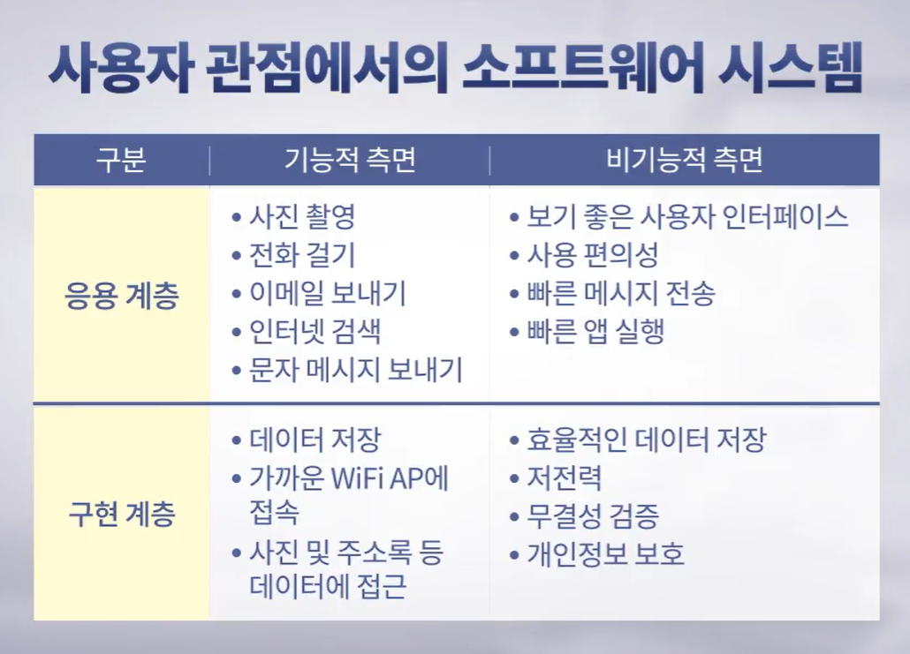
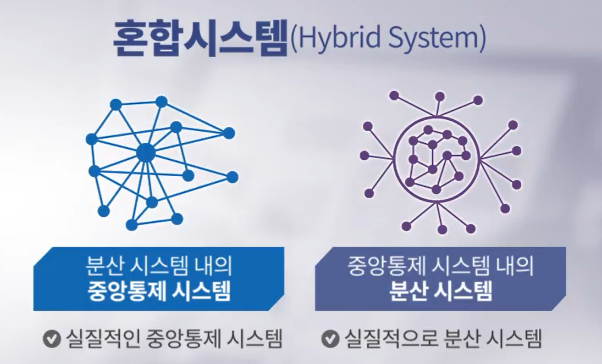

# 3. 블록체인과 소프트웨어 기술

## 3-1. 소프트웨어 시스템 계층

#### 소프트웨어 시스템 계층과 측면

- 소프트웨어 시스템의 구분 기준
  - __계층(Layer)__ : 사용자의 요구사항, 혹은 목적과 이를 달성하기 위한 시스템의 기술구조와 관련
    - 응용 계층(Application Layer) : 사용자의 필요(ex. 기차 예약, 온라인 쇼핑, 사진 촬영, 인터넷 검색 등)
    - 구현 계층(Implementation Layer) : 목적 달성을 위한 기술(ex. 온라인 결제 방법, 사진이 디지털화 되어 픽셀을 인식하는 방법 등), 응용 계층에서 요구되는 목적달성을 위한 기술적인 수단
  - __측면(Aspect)__ : 시스템이 무엇을 하는가, 그리고 시스템이 그것을 어떻게 달성하는가와 연관
    - 기능적 측면(Functional Aspect) : 사용자가 직접 경험 가능한 시스템의 기능(ex. 사진 촬영, 전화 걸기, 이메일 보내기 등)
    - 비기능적 측면(Nonfunctional Aspect) : 구현 방법(ex. 인터페이스의 편의성, 얼마나 빠르게 문자 메시지를 전송할 수 있는지, 에너지의 소비 등), __무결성__과 __보안__이 특히 중요

#### 소프트웨어 시스템 무결성

- 정보 보안의 __세가지 요소__
  - 기밀성(Confidentiality) : 합법적인 권한이 있는 사용자만이 이 정보에 접근이 가능해야 함
  - 가용성(Availability) : 어떤 시스템이나 소프트웨어들이 항상 그 서비스를 제공함으로써 사용자가 언제, 어디서든지 자신들이 원할 때 접근해서 서비스 받을 수 있어야 함
  - __무결성(Integrity)__ : 데이터나 소프트웨어 시스템이 원래 의도한 대로 정확하게 동작하거나 원래 오리지널 데이터와 같아야 함(블록체인가 가장 밀접한 보안 요소) 
- 무결성의 세 가지 요소
  - 데이터 무결성(Data Integrity)
    - 데이터가 원래의 데이터와 일치해야 함
    - 위변조나 삭제되는 경우에 쉽게 효율적으로 탐지하고 복구할 수 있어야 됨
  - 연산 무결성(Computation Integrity) 
    - 특정 연산이나 어떤 처리를 할 경우 그 결과를 신뢰할수 있어야 함
    - 전혀 오류가 없이 정확한 결과를 받을 수 있어야 함
  - 작동 무결성(Function Integrity) 
    - 의도한 대로 동작하며 논리적인 오류가 없어야 함
- 무결청 침해의 예시
  - 시스템 결과의 오류(연산 무결성 침해)
  - 시스템 데이터 손실(데이터 무결성 침해)
  - 시스템의 비논리적 작동(작동 무결성 침해)

## 3-2. 소프트웨어 아키텍쳐 측면에서의 블록체인

#### 소프트웨어 시스템 아키텍쳐

- 소프트웨어 시스템 아키텍쳐

  - 정의
    - 소프트웨어 구성요소 구조화하고 구성요소 간 관계 설정 하는 것
    - 소프트웨어 구성요소 간 관계 설정

  - 성능, 안정성, 응용 분야, 안전성, 개발 및 유지 비용에 막대한 영향을 끼침

- 중앙통제(Centralized) 방식

  - 모든 노드들은 중앙 노드에 직접 연결
  - 중앙 노드가 전체 시스템을 통제

- __분산(Distributed) 방식__

  - 노드들은 직간접적으로 연결
  - 중앙의 통제 노드 없음

#### 분산 시스템의 장점과 단점

- 장점
  - 계산 능력이 더 뛰어남
  - 비용이 절감됨
  - 중앙통제 방식보다 안정적임
  - 자연스럽게 확장됨
- 단점
  - 조정 오버헤드가 발생함
  - 통신 오버헤드가 발생함
  - 네트워크 의존도가 높음
  - 프로그램이 복잡해짐
  - __보안__에 신경써야 함

#### 블록체인의 목적

- P2P(Peer To Peer) 네트워크란?
  - 분산시스템의 특별한 형태
  - 네트워크를 구성하는 개별 컴퓨터들이 자원 공유
  - 각 컴퓨터는 자원의 공급자이자 동시에 소비자
- 혼합 시스템(Hybird System)
  - 전체시스템을 통제할 수 있는 단일 구성요소 여부에 따라 구분

- 블록체인의 목적: 분산 시스템의 __무결성__ 구현 및 유지(비기능적 측면을 성취하게 해주는 도구)

## 3-3. P2P 네트워크 시스템

#### P2P 시스템 정의

- 여러 노드(개별 컴퓨터)들로 구성된 분산 소프트웨어 시스템
  - 노드
    - 한 노드의 자원을 다른 노드들이 직접 사용
    - 시스템 내에서 동일한 기능과 책임을 가짐
    - 자원의 공급자이자 동시에 소비자

#### P2P 시스템 아키텍쳐

- 분산 P2P 시스템
  - 개별 노드들이 자원 공유
- 중앙통제 P2P 시스템(혼합형 분산 시스템)
  - 중앙노드를 이용해 노드간 상호작용 중재
  - 피어 노드가 제공하는 서비스 목록들을 유지 관리
  - 노드를 검색하고 식별

#### P2P 시스템과 블록체인의 연관성

- 블록체인은 P2P 시스템의 무결성을 확보하고 유지하는 도구
- 특수 순수 분산 P2P 시스템의 무결성 확보와 유지를 위해 블록체인 사용

